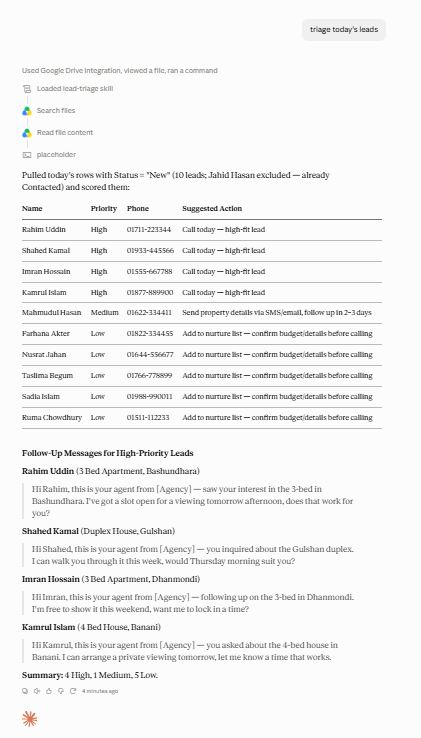
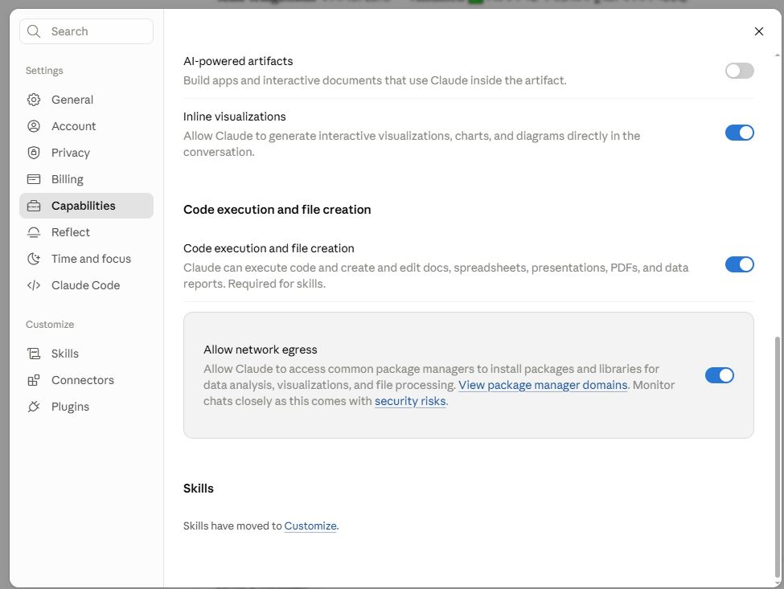
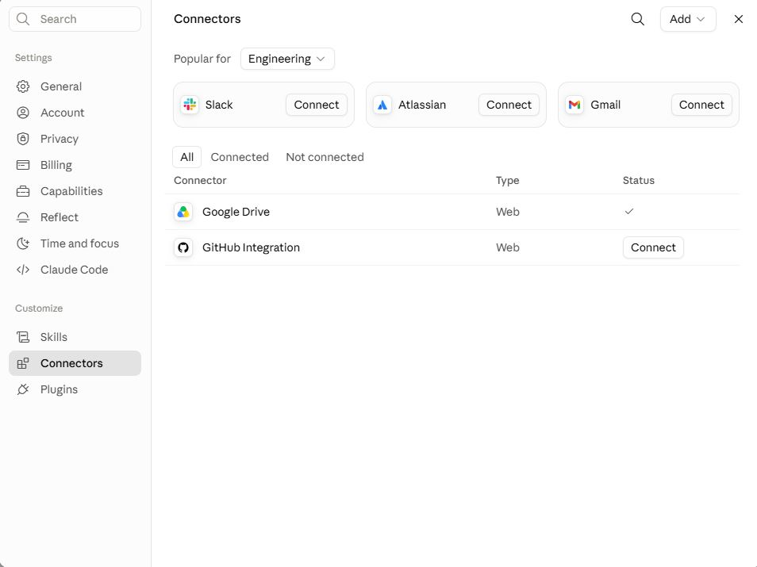
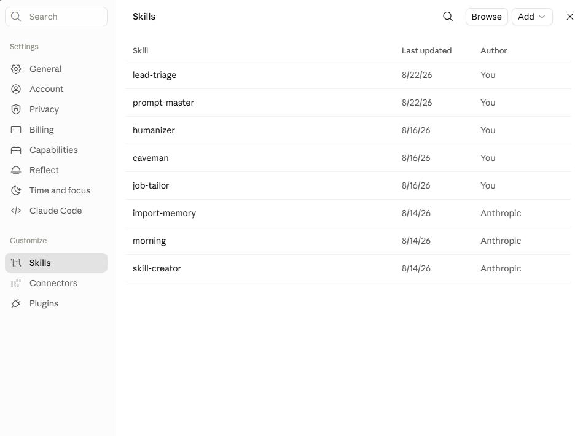
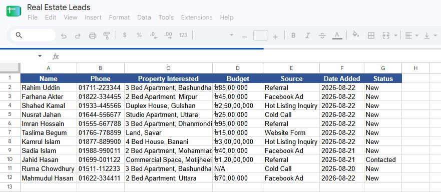
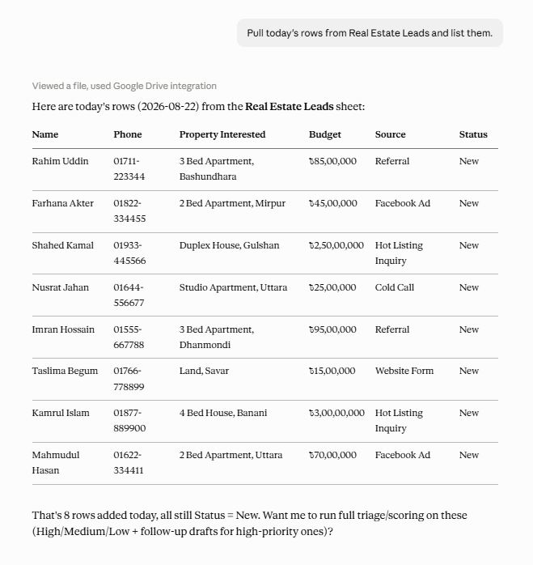

# Real Estate Lead Triage: a Claude Skill

   

A real estate agent opens Claude in the morning and types four words: **triage today's leads**. Claude finds the agent's "Real Estate Leads" Google Sheet, pulls every row marked New, scores each lead High, Medium or Low, sorts the list, and writes a short follow-up text for each High lead. No copy-pasting between tabs, no eyeballing budgets against a price list.

This repo holds that Skill, the test data behind it, screenshots of a real run, and a small Python script that applies the same rules so you can check the expected output without opening a chat.



## Result of the live run

Ten leads had Status = New. One more (Jahid Hasan) was already Contacted and was left out, which is what the Skill is told to do.

| Tier | Leads | Why |
|---|---|---|
| High | 4 | Budget inside the inventory range and a referral or hot listing source |
| Medium | 1 | Budget inside the range, but the lead came from an ad |
| Low | 5 | Budget outside the range, or no budget on file |
| Skipped | 1 | Status was Contacted, not New |

Every one of the 10 New leads landed in exactly one bucket, and only the 4 High leads got a drafted message.

## What the Skill does, step by step

The logic lives in [`skill/lead-triage/SKILL.md`](skill/lead-triage/SKILL.md). Plain-language version:

1. **Pull the data first.** Claude reads the sheet through the Google Drive connector. If the sheet or the connector is missing, it says so and stops. It is explicitly told never to invent sample leads to fill a table.
2. **Keep only New rows.** Status is compared case-insensitively with whitespace trimmed, so "new " and "NEW" both count. Contacted and Closed rows are ignored.
3. **Parse the budget.** Values look like `৳85,00,000`. The Skill strips the currency symbol and commas and reads the number in the South Asian lakh and crore grouping, so `85,00,000` becomes 8,500,000. Blank, `N/A` or unreadable values count as unknown.
4. **Classify the source.** Anything that contains "referral" or "hot" goes in the hot bucket ("Referral", "Hot Listing Inquiry", "Client Referral"). Everything else that looks like a real lead source, such as Facebook Ad, Cold Call or Website Form, goes in the cold bucket. The match is fuzzy on purpose, so a slightly different phrase in the sheet still lands in the right place.
5. **Score.** Rules are applied in a fixed order:
   - Low if the budget is unknown, the phone number is missing, or the budget falls outside ৳50,00,000 to ৳3,00,00,000.
   - High if the budget is in range and the source is hot or a referral.
   - Medium if the budget is in range and the source is anything else.
6. **Sort** High, then Medium, then Low, keeping sheet order inside each tier.
7. **Write the output.** A table with name, priority, phone and a suggested action, then two-line follow-up messages for High leads only, then a one-line count summary.

The suggested action depends on the tier. High leads get "Call today, high-fit lead". Medium leads get "Send property details via SMS/email, follow up in 2 to 3 days". Low leads go to the nurture list, or are marked email-only when the phone number is missing.

The inventory range is inclusive at both ends. Kamrul Islam's budget is exactly ৳3,00,00,000, and he is High.

## Setting it up

Skills in Claude need code execution and file creation turned on, and the Skill reads its data through a connector, so two switches matter before the first run.



*Code execution and file creation is on (Claude's own note says it is required for skills).*



*Google Drive is connected. This is how Claude reaches the lead sheet.*



*`lead-triage` installed under Customize, next to a few other personal skills.*

To install it yourself: open Claude's settings, go to Customize, then Skills, use the Add button, and upload [`skill/lead-triage.skill`](skill/lead-triage.skill). The `.skill` file is just a zip of the `lead-triage` folder with `SKILL.md` inside.

You also need a Google Sheet called **Real Estate Leads** with these columns: Name, Phone, Property Interested, Budget, Source, Date Added, Status. A copy of the test data is in [`data/real_estate_leads_sample.csv`](data/real_estate_leads_sample.csv).

## The data

The sheet used for testing has 11 rows. Budgets are stored as text with the taka sign, the way an agent would naturally type them.



All names, numbers and addresses are made-up test data.

## Running it

First a plain read, to check Claude is really looking at the sheet. I asked it to pull the day's rows and list them:



It returned the eight rows dated 2026-08-22, all with Status = New, and offered to run the full triage. Later the sheet had more rows added, including the older ones from 08-20 and 08-21, which is why the full run covers 10 New leads instead of 8.

Then the actual triage, triggered with "triage today's leads":


The status line above the answer shows Claude loading the skill, searching Drive, and reading the file content before it wrote anything. The full result:

| Name | Priority | Budget | Source | Reason |
|---|---|---|---|---|
| Rahim Uddin | High | ৳85,00,000 | Referral | In range, referral |
| Shahed Kamal | High | ৳2,50,00,000 | Hot Listing Inquiry | In range, hot source |
| Imran Hossain | High | ৳95,00,000 | Referral | In range, referral |
| Kamrul Islam | High | ৳3,00,00,000 | Hot Listing Inquiry | Exactly at the top of the range |
| Mahmudul Hasan | Medium | ৳70,00,000 | Facebook Ad | In range, but from an ad |
| Farhana Akter | Low | ৳45,00,000 | Facebook Ad | Below the range |
| Nusrat Jahan | Low | ৳25,00,000 | Cold Call | Below the range |
| Taslima Begum | Low | ৳15,00,000 | Website Form | Below the range |
| Sadia Islam | Low | ৳40,00,000 | Facebook Ad | Below the range |
| Ruma Chowdhury | Low | N/A | Cold Call | No budget on file |

The follow-up messages are written to be sent as a text, not as marketing copy. Each one names the property and offers one concrete next step. For Rahim it reads: "saw your interest in the 3-bed in Bashundhara. I've got a slot open for a viewing tomorrow afternoon, does that work for you?"

## Checking the logic without Claude

Chat output varies from run to run. The scoring rules should not. [`scripts/score_leads.py`](scripts/score_leads.py) applies the same rules in plain Python to the sample CSV:

```bash
python scripts/score_leads.py
```

It prints the sorted table and exits with an error if the counts stop matching the live run (4 High, 1 Medium, 5 Low, 1 skipped). If you change a threshold in `SKILL.md`, change it here too and the script tells you what moved.

## What testing turned up

The scoring was right on every run. The weak spot was my test data.

The first mock sheet had no lead with an in-range budget and an ad or cold-call source, so the Medium branch was never exercised. Everything was High or Low, and it looked fine. Adding Mahmudul Hasan (৳70,00,000, Facebook Ad) closed the gap, and the Skill scored him Medium. The one-page write-up is in [`docs/Reflection.pdf`](docs/Reflection.pdf).

## Limits I know about

- **Source matching is fuzzy.** It copes with variants like "Client Referral", but a typo or an odd phrase could land in the wrong bucket. A dropdown on the Source column in the sheet would remove the guesswork.
- **Budget has to look like a number.** An entry like "85 lakh" or a missing taka sign is treated as incomplete, so a perfectly good lead drops to Low. A numeric-only Budget column would fix that at the source.
- **Follow-ups carry a placeholder.** The drafts say "this is your agent from [Agency]" because the Skill does not know the agent's name or agency. Adding both to the Skill would make the texts ready to send.
- **The price range is written into the Skill.** Changing the inventory means editing `SKILL.md` by hand.
- **Phone numbers are only checked for presence,** not for format.

## Repository layout

```
.
├── README.md
├── skill/
│   ├── lead-triage.skill          packaged skill, ready to upload
│   └── lead-triage/SKILL.md       the skill instructions
├── data/
│   └── real_estate_leads_sample.csv
├── scripts/
│   └── score_leads.py             reference implementation of the scoring rules
├── docs/
│   └── Reflection.pdf
└── screenshots/                   six images used above
```

## Author

Romith
GitHub: [@ismam-tasnime](https://github.com/ismam-tasnime)
